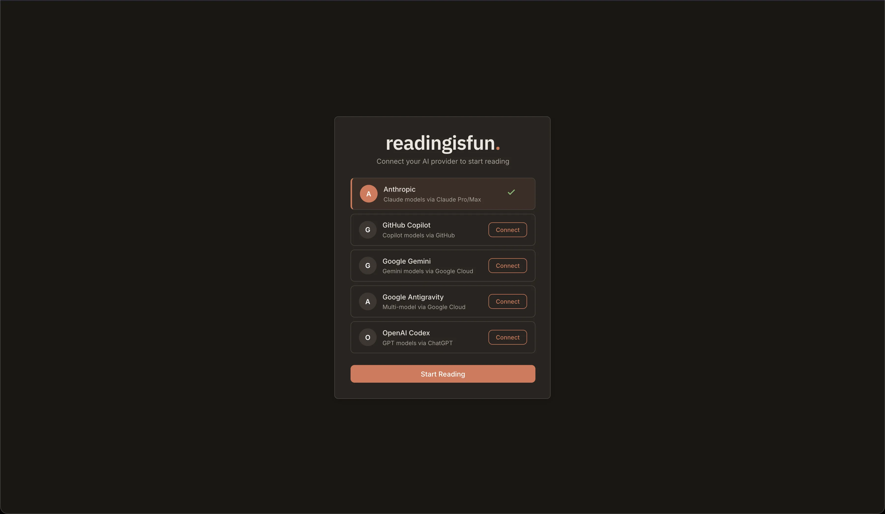
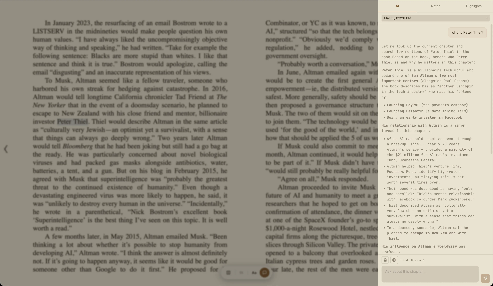
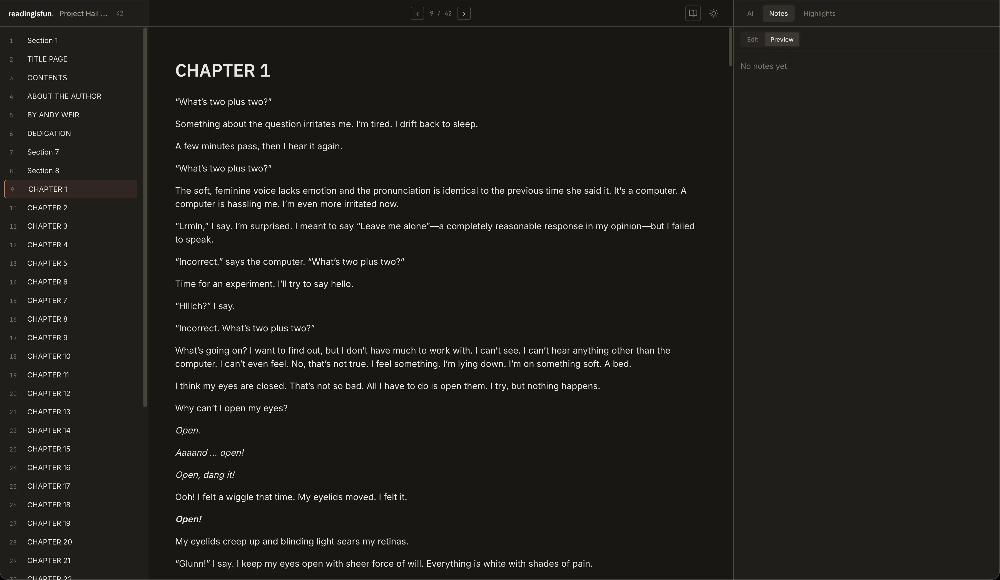
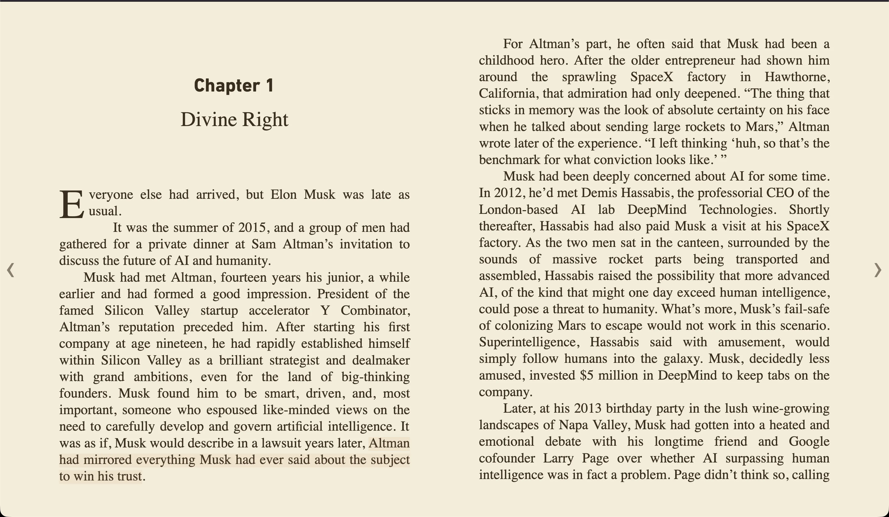
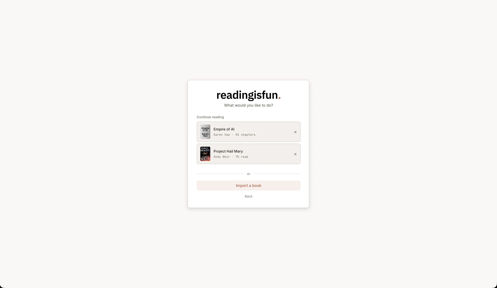

# readingisfun.

EPUB reader with coding agent integration. Uses your existing CLI subscription (Copilot, Claude Code, Codex, Gemini).





## How to Run

```bash
pnpm install
cp server/.env.example server/.env
cp client/.env.example client/.env
pnpm dev
```

Client runs on `http://localhost:5173`, server on `http://localhost:3002`.

## Features

### Two Reading Modes

- **Study Mode** — Three-panel layout: chapter sidebar on the left, raw XHTML content in the center, AI chat / notes / highlights on the right. Panels are resizable and collapsible.



- **Reader Mode** — Paginated EPUB rendering via [epub.js](https://github.com/futurepress/epub.js). Single-column view with page turns, three themes (light, sepia, dark), adjustable font size. AI and highlights accessible via slide-over panel on text selection.



### AI Chat

Chat with an AI agent about what you're reading. The agent has read-only access to the book's content and can reference any chapter.

- Works with any provider: Anthropic, GitHub Copilot, Google Gemini, OpenAI Codex
- Authenticate through existing CLI subscriptions — no extra API keys needed

### Web Search

The AI agent can search the web via [Exa](https://exa.ai) for information beyond the book's content. Set `EXA_API_KEY` in `server/.env` and `VITE_WEB_SEARCH=true` in `client/.env` (see setup above). A globe icon appears next to the chat input to toggle it.

### Highlights & Notes

- Select text to highlight it (visually marked in reader mode)
- Take markdown notes per chapter
- All highlights and notes persist locally

### EPUB Import

- Import any `.epub` file



### Data

Everything lives in `~/.readingisfun/`

```
~/.readingisfun/
├── auth.json                  # OAuth tokens
├── uploads/                   # Original EPUB files
└── books/{bookId}/
    ├── manifest.json           # Book metadata & chapter index
    ├── progress.json           # Reading percentage & last CFI position
    ├── images/                 # Extracted images
    └── chapters/{N}/
        ├── raw.html            # Chapter content (EPUB XHTML body)
        ├── metadata.json       # Title, word count, image refs
        ├── notes.md            # Your notes
        ├── highlights.json     # Your highlights
        └── chats/              # AI chat sessions
```
